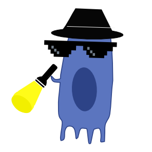

<!-- README.md is generated from README.Rmd. Please edit that file -->

# CIA

<!-- badges: start -->

[](https://github.com/ingmbioinfo/CIA_R/actions/workflows/R-CMD-check.yaml)
<!-- badges: end -->

`CIA` (Cluster Independent Annotation) is a cutting-edge computational
tool designed to accurately classify cells in scRNA-seq datasets using
gene signatures. This tool operates without the need for a fully
annotated reference dataset or complex machine learning processes,
providing a highly user-friendly and practical solution for cell type
annotation.

`CIA` summarizes the information of each signature expression into a
single score value for each cell. By comparing these score values, `CIA`
assigns labels to each cell based on the top-scored signature. `CIA` can
filter scores by their distribution or significance, allowing comparison
of genesets with lengths spanning tens to thousands of genes.

`CIA` is implemented in both R and Python, making it compatible with all
major single-cell analysis frameworks like `SingleCellExperiment`,
`Seurat`, and `Scanpy`. This compatibility ensures a seamless
integration into existing workflows.

## Key Features

- **Automatic Annotation**: Accurately labels cell types in scRNA-seq
  datasets based on gene signatures.
- **Clustering-Free**: Operates independently of clustering steps,
  enabling flexible and rapid data exploration.
- **Multi-Language Support**: Available in both R and Python to suit
  diverse user preferences.
- **Compatibility**: Integrates with popular single-cell data formats
  (AnnData, SingleCellExperiment, SeuratObject).
- **Statistical Analysis**: Offers functions for evaluating the quality
  of signatures and classification performance.
- **Documentation and Tutorials**: Comprehensive guides to facilitate
  easy adoption and integration into existing workflows.

## Documentation

- **Python Package**:
  `CIA Python <https://pypi.org/project/cia-python/>`\_
- **Python docs**:
  `CIA Python documentation <https://cia-python.readthedocs.io/en/latest/index.html>`\_
- **R Package and Tutorial**:
  `CIA R GitHub Repository <https://github.com/ingmbioinfo/cia/tree/master/tutorial>`\_

## Installation

You can install the development version of `CIA` from GitHub with:

``` r
library("remotes")
remotes::install_github("ingmbioinfo/CIA_R", 
                        dependencies = TRUE, build_vignettes = TRUE)
```

## Development

If you encounter a bug, have usage questions, or want to share ideas and
functionality to make this package better, feel free to file an
[issue](https://github.com/ingmbioinfo/CIA_R/issues).

## Code of Conduct

Please note that the CIA project is released with a [Contributor Code of
Conduct](https://contributor-covenant.org/version/2/1/CODE_OF_CONDUCT.html).
By contributing to this project, you agree to abide by its terms.

## License

MIT
